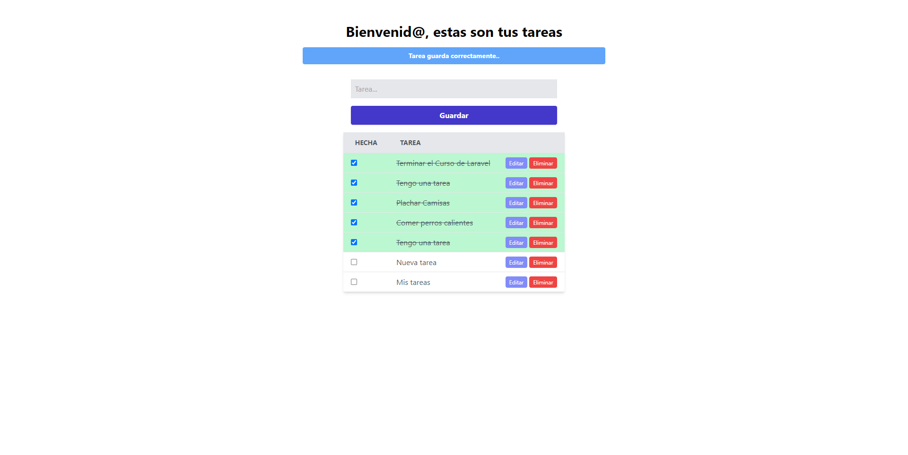

## ToDo App With Livewire
To Do List (Lista de tareas), donde podremos listar las tareas, crear nuevas tareas, editarlas, eliminarlas
y marcarlas como terminadas. 
Se hace uso de los componentes de Livewire, sus propiedades, métodos o acciones, eventos y hooks.

### Tecnologías usadas:
* PHP 8.0.2
* Laravel v9.19
* Livewire v2.12

### App Screenshot

